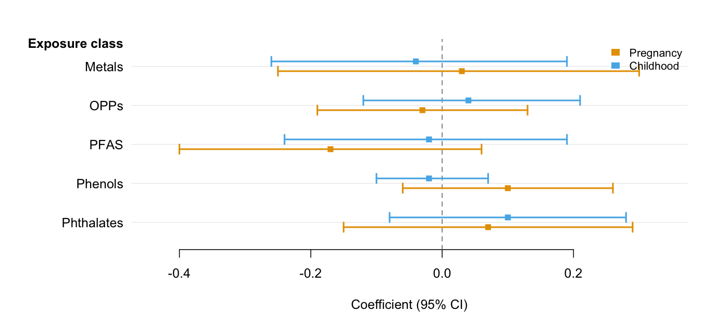
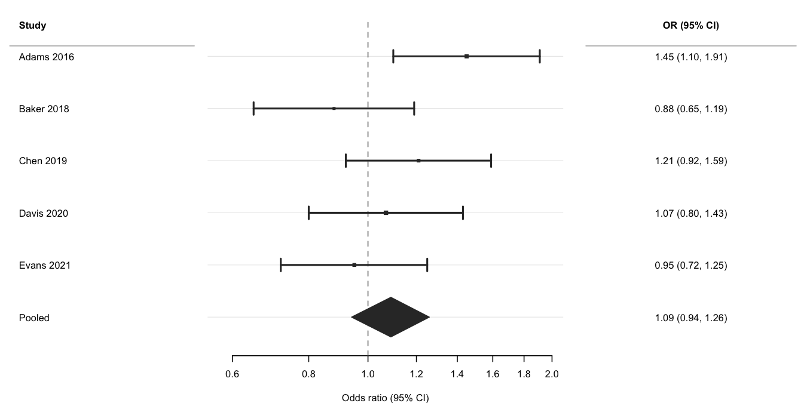
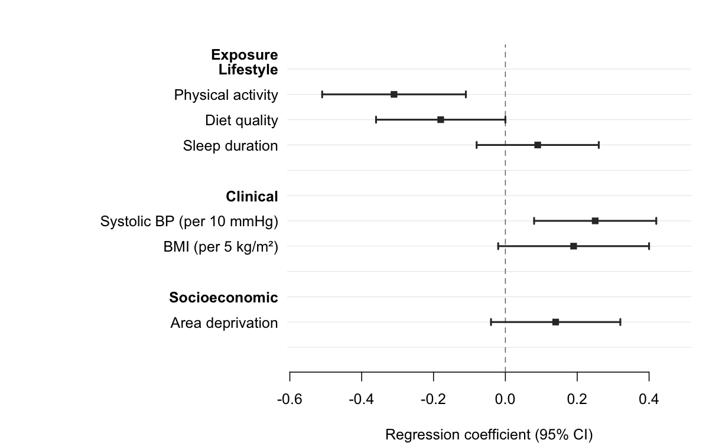
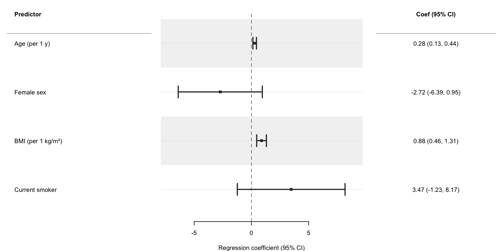

<!-- README.md is generated from README.Rmd. Do not edit it directly. -->

# forrest 

<!-- badges: start -->

[](https://lifecycle.r-lib.org/articles/stages.html#experimental)
[](https://CRAN.R-project.org/package=forrest)
[](https://github.com/lorenzoFabbri/forrest/actions/workflows/R-CMD-check.yaml)
[](https://app.codecov.io/gh/lorenzoFabbri/forrest?branch=main)
[](https://cran.r-project.org/package=forrest)
[](https://buymeacoffee.com/epilorenzo)
<!-- badges: end -->

`forrest` creates publication-ready forest plots from any data frame
that contains point estimates and confidence intervals — regression
models, subgroup analyses, meta-analyses, dose-response patterns, and
more. A single dependency
([tinyplot](https://github.com/grantmcdermott/tinyplot)) keeps the
footprint minimal.

**Key features:**

- Works with any estimates and CIs: regression coefficients, ORs, HRs,
  MDs, …
- Automatic section headers from a grouping column (`section` argument)
  — no manual NA rows
- Two-level hierarchy with `subsection` for nested grouping structures
- Summary estimates rendered as filled diamonds (`is_summary`)
- Reference-category rows (NA estimate) rendered without CI, optionally
  annotated with `" (Ref.)"`
- Alternating row stripes for readability (`stripe = TRUE`)
- Group colouring with automatic Okabe-Ito legend
- Optional text columns (formatted estimates, p-values, …) alongside the
  plot
- Section-level text column annotations via `section_cols`
- Log-scale x-axis for ratio measures
- CI clipping at axis limits with directional arrows
- Point size proportional to row weights
- Export to PDF, PNG, SVG, or TIFF with `save_forrest()`
- Works with `data.frame`, `tibble`, and `data.table`

## Installation

``` r
install.packages("forrest")

# Development version from GitHub:
# install.packages("pak")
pak::pak("lorenzoFabbri/forrest")
```

## Quick start

### Introduction

The minimal call requires only three column names — `estimate`, `lower`,
and `upper`. Use `group` and `dodge = TRUE` to place multiple CIs per
row when comparing results across categories (e.g., time periods, sexes,
models). See the [Introduction
vignette](https://lorenzofabbri.github.io/forrest/vignettes/intro.html)
for the full feature tour.

``` r
library(forrest)

# Two estimates per exposure (e.g., two time windows)
periods <- data.frame(
  exposure = rep(c("Metals", "OPPs", "PFAS", "Phenols", "Phthalates"), each = 2),
  period   = rep(c("Pregnancy", "Childhood"), 5),
  est      = c( 0.03, -0.04, -0.03,  0.04, -0.17, -0.02,  0.10, -0.02,  0.07,  0.10),
  lo       = c(-0.25, -0.26, -0.19, -0.12, -0.40, -0.24, -0.06, -0.10, -0.15, -0.08),
  hi       = c( 0.30,  0.19,  0.13,  0.21,  0.06,  0.19,  0.26,  0.07,  0.29,  0.28)
)

forrest(
  periods,
  estimate = "est",
  lower    = "lo",
  upper    = "hi",
  label    = "exposure",
  group    = "period",
  dodge    = TRUE,
  header   = "Exposure class",
  ref_line = 0,
  xlab     = "Coefficient (95% CI)"
)
```



### Meta-analysis

Use `log_scale = TRUE` and `ref_line = 1` for ratio measures,
`is_summary = TRUE` to draw the pooled row as a filled diamond, and
`weight` to scale point sizes by inverse-variance weights. See the
[Meta-analysis
vignette](https://lorenzofabbri.github.io/forrest/vignettes/meta.html)
for subgroup analyses and multi-exposure layouts.

``` r
ma <- data.frame(
  study  = c("Adams 2016", "Baker 2018", "Chen 2019",
             "Davis 2020", "Evans 2021", "Pooled"),
  est    = c(1.45, 0.88, 1.21, 1.07, 0.95, 1.09),
  lo     = c(1.10, 0.65, 0.92, 0.80, 0.72, 0.94),
  hi     = c(1.91, 1.19, 1.59, 1.43, 1.25, 1.26),
  weight = c(180, 95, 140, 210, 160, NA),
  is_sum = c(FALSE, FALSE, FALSE, FALSE, FALSE, TRUE)
)
ma$or_ci <- sprintf("%.2f (%.2f, %.2f)", ma$est, ma$lo, ma$hi)

forrest(
  ma,
  estimate   = "est",
  lower      = "lo",
  upper      = "hi",
  label      = "study",
  is_summary = "is_sum",
  weight     = "weight",
  log_scale  = TRUE,
  ref_line   = 1,
  header     = "Study",
  cols       = c("OR (95% CI)" = "or_ci"),
  widths     = c(2.2, 4, 2.5),
  xlab       = "Odds ratio (95% CI)"
)
```



### Section headers

Pass a column name to `section` to group rows under automatic bold
headers. `forrest()` inserts a header wherever the section value
changes, indents the row labels, and adds a blank spacer after each
group — no manual data manipulation required.

``` r
subgroups <- data.frame(
  domain   = c("Lifestyle",  "Lifestyle",  "Lifestyle",
               "Clinical",   "Clinical",
               "Socioeconomic"),
  exposure = c("Physical activity", "Diet quality", "Sleep duration",
               "Systolic BP (per 10 mmHg)", "BMI (per 5 kg/m\u00b2)",
               "Area deprivation"),
  est      = c(-0.31, -0.18, 0.09, 0.25,  0.19, 0.14),
  lo       = c(-0.51, -0.36, -0.08, 0.08, -0.02, -0.04),
  hi       = c(-0.11, -0.00,  0.26, 0.42,  0.40,  0.32)
)

forrest(
  subgroups,
  estimate = "est",
  lower    = "lo",
  upper    = "hi",
  label    = "exposure",
  section  = "domain",
  header   = "Exposure",
  ref_line = 0,
  xlab     = "Regression coefficient (95% CI)"
)
```



### Regression models

Use [`broom::tidy()`](https://broom.tidymodels.org/) to extract
parameters from a fitted model and pass the result directly to
`forrest()`. The `cols` argument adds a formatted text column alongside
the plot; `header` labels the row-label panel. See the [Regression
models
vignette](https://lorenzofabbri.github.io/forrest/vignettes/regression.html)
for progressive adjustment, multiple outcomes, dose-response, and causal
inference (g-computation, IPW) examples.

``` r
set.seed(1)
n   <- 300
dat <- data.frame(
  sbp    = 120 + rnorm(n, sd = 15),
  age    = runif(n, 30, 70),
  female = rbinom(n, 1, 0.5),
  bmi    = rnorm(n, 26, 4),
  smoker = rbinom(n, 1, 0.2)
)
dat$sbp <- dat$sbp + 0.3 * dat$age - 4 * dat$female +
           0.5 * dat$bmi - 2 * dat$smoker + rnorm(n, sd = 6)

fit   <- lm(sbp ~ age + female + bmi + smoker, data = dat)
coefs <- broom::tidy(fit, conf.int = TRUE)
coefs <- coefs[coefs$term != "(Intercept)", ]
coefs$term <- c("Age (per 1 y)", "Female sex",
                "BMI (per 1 kg/m²)", "Current smoker")

coefs$coef_ci <- sprintf(
  "%.2f (%.2f, %.2f)",
  coefs$estimate, coefs$conf.low, coefs$conf.high
)

forrest(
  coefs,
  estimate = "estimate",
  lower    = "conf.low",
  upper    = "conf.high",
  label    = "term",
  header   = "Predictor",
  cols     = c("Coef (95% CI)" = "coef_ci"),
  widths   = c(3, 4, 2.5),
  xlab     = "Regression coefficient (95% CI)",
  stripe   = TRUE
)
```



## Compared with other packages

| Feature | forrest | forestplot | forestploter | ggforestplot |
|----|:--:|:--:|:--:|:--:|
| Minimal dependencies | ✅ | ❌ | ❌ | ❌ |
| General (not meta-analysis only) | ✅ | ⚠️ | ⚠️ | ❌ |
| Study weight sizing | ✅ | ✅ | ✅ | ❌ |
| Auto section headers from grouping column | ✅ | ❌ | ❌ | ❌ |
| Two-level nested section hierarchy | ✅ | ❌ | ❌ | ❌ |
| Summary diamonds | ✅ | ✅ | ✅ | ✅ |
| Text columns | ✅ | ✅ | ✅ | ❌ |
| Alternating row stripes | ✅ | ❌ | ✅ | ❌ |
| CI clipping with arrows | ✅ | ✅ | ❌ | ❌ |
| Group colouring + legend | ✅ | ❌ | ✅ | ✅ |
| Log-scale axis | ✅ | ✅ | ✅ | ❌ |
| Export helper | ✅ | ❌ | ❌ | ❌ |
| data.table support | ✅ | ❌ | ❌ | ❌ |
| Actively maintained | ✅ | ⚠️ | ✅ | ❌ |
