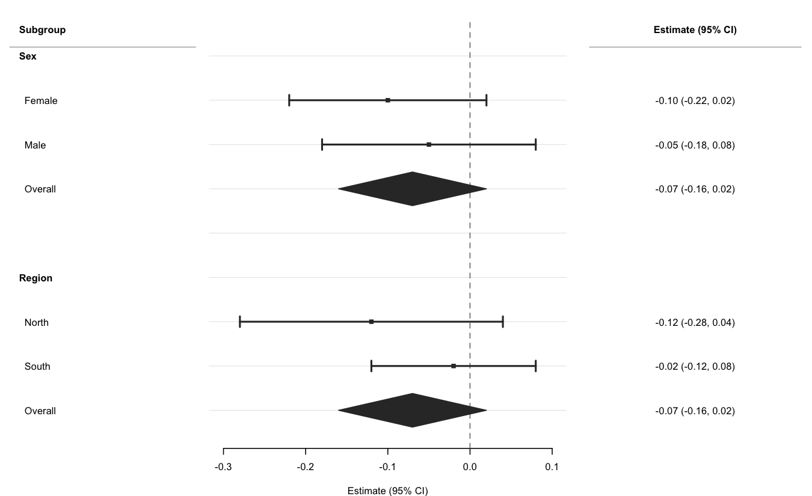
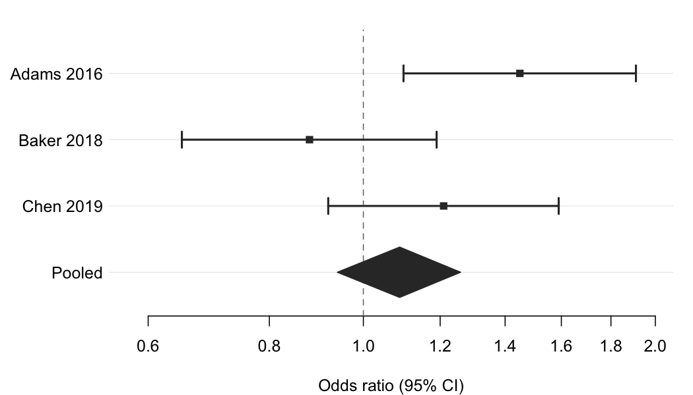

<!-- README.md is generated from README.Rmd. Do not edit it directly. -->

# forrest 

<!-- badges: start -->

[](https://lifecycle.r-lib.org/articles/stages.html#experimental)
[](https://CRAN.R-project.org/package=forrest)
[](https://github.com/lorenzoFabbri/forrest/actions/workflows/R-CMD-check.yaml)
[](https://app.codecov.io/gh/lorenzoFabbri/forrest?branch=main)
[](https://cran.r-project.org/package=forrest)
[](https://www.buymeacoffee.com/epilorenzo)
<!-- badges: end -->

`forrest` creates publication-ready forest plots from any data frame
that contains point estimates and confidence intervals — regression
models, subgroup analyses, meta-analyses, dose-response patterns, and
more. A single dependency
([tinyplot](https://github.com/grantmcdermott/tinyplot)) keeps the
footprint minimal.

**Key features:**

- Works with any estimates and CIs: regression coefficients, ORs, HRs,
  MDs, …
- Group and subgroup headings via `NA` estimate rows
- Summary estimates rendered as filled diamonds
- Alternating row stripes for readability (`stripe = TRUE`)
- Group colouring with automatic Okabe-Ito legend
- Optional text columns (formatted estimates, p-values, …) alongside the
  plot
- Log-scale x-axis for ratio measures
- CI clipping at axis limits with directional arrows
- Point size proportional to row weights
- Export to PDF, PNG, SVG, or TIFF with `save_forrest()`
- Works with `data.frame`, `tibble`, and `data.table`

## Installation

``` r
# Development version from GitHub:
# install.packages("pak")
pak::pak("lorenzoFabbri/forrest")
```

## Quick start

### Regression model predictors

Use [`broom::tidy()`](https://broom.tidymodels.org/) to extract
parameters from a fitted model and pass the result directly to
`forrest()`.

``` r
library(forrest)

set.seed(1)
n   <- 300
dat <- data.frame(
  sbp    = 120 + rnorm(n, sd = 15),
  age    = runif(n, 30, 70),
  female = rbinom(n, 1, 0.5),
  bmi    = rnorm(n, 26, 4),
  smoker = rbinom(n, 1, 0.2)
)
dat$sbp <- dat$sbp + 0.3 * dat$age - 4 * dat$female +
           0.5 * dat$bmi - 2 * dat$smoker + rnorm(n, sd = 6)

fit   <- lm(sbp ~ age + female + bmi + smoker, data = dat)
coefs <- broom::tidy(fit, conf.int = TRUE)
coefs <- coefs[coefs$term != "(Intercept)", ]
coefs$term <- c("Age (per 1 y)", "Female sex",
                "BMI (per 1 kg/m²)", "Current smoker")

forrest(
  coefs,
  estimate = "estimate",
  lower    = "conf.low",
  upper    = "conf.high",
  label    = "term",
  xlab     = "Regression coefficient (95% CI)",
  stripe   = TRUE
)
```


### Subgroup analysis with text columns

``` r
sub <- data.frame(
  label  = c(
    "Sex", "  Female", "  Male", "  Overall",
    "", "Region", "  North", "  South", "  Overall"
  ),
  est    = c(NA, -0.10, -0.05, -0.07, NA, NA, -0.12, -0.02, -0.07),
  lo     = c(NA, -0.22, -0.18, -0.16, NA, NA, -0.28, -0.12, -0.16),
  hi     = c(NA,  0.02,  0.08,  0.02, NA, NA,  0.04,  0.08,  0.02),
  is_sum = c(FALSE, FALSE, FALSE, TRUE, FALSE, FALSE, FALSE, FALSE, TRUE),
  text   = c(
    "", "-0.10 (-0.22, 0.02)", "-0.05 (-0.18, 0.08)",
    "-0.07 (-0.16, 0.02)", "",
    "", "-0.12 (-0.28, 0.04)", "-0.02 (-0.12, 0.08)",
    "-0.07 (-0.16, 0.02)"
  )
)

forrest(
  sub,
  estimate   = "est",
  lower      = "lo",
  upper      = "hi",
  label      = "label",
  is_summary = "is_sum",
  header     = "Subgroup",
  cols       = c("Estimate (95% CI)" = "text"),
  widths     = c(2.2, 4, 2.5)
)
```



### Log scale for ratio measures

``` r
or_dat <- data.frame(
  study  = c("Adams 2016", "Baker 2018", "Chen 2019", "Pooled"),
  est    = c(1.45, 0.88, 1.21, 1.09),
  lo     = c(1.10, 0.65, 0.92, 0.94),
  hi     = c(1.91, 1.19, 1.59, 1.26),
  is_sum = c(FALSE, FALSE, FALSE, TRUE)
)

forrest(
  or_dat,
  estimate   = "est",
  lower      = "lo",
  upper      = "hi",
  label      = "study",
  is_summary = "is_sum",
  log_scale  = TRUE,
  ref_line   = 1,
  xlab       = "Odds ratio (95% CI)"
)
```



## Compared with other packages

| Feature | forrest | forestplot | forestploter | ggforestplot |
|----|:--:|:--:|:--:|:--:|
| Minimal dependencies | ✅ | ❌ | ❌ | ❌ |
| General (not meta-analysis only) | ✅ | ⚠️ | ⚠️ | ❌ |
| Study weight sizing | ✅ | ✅ | ✅ | ❌ |
| Subgroup headers | ✅ | ✅ | ✅ | ❌ |
| Summary diamonds | ✅ | ✅ | ✅ | ✅ |
| Text columns | ✅ | ✅ | ✅ | ❌ |
| Alternating row stripes | ✅ | ❌ | ✅ | ❌ |
| CI clipping with arrows | ✅ | ✅ | ❌ | ❌ |
| Group colouring + legend | ✅ | ❌ | ✅ | ✅ |
| Log-scale axis | ✅ | ✅ | ✅ | ❌ |
| Export helper | ✅ | ❌ | ❌ | ❌ |
| data.table support | ✅ | ❌ | ❌ | ❌ |
| Actively maintained | ✅ | ⚠️ | ✅ | ❌ |
